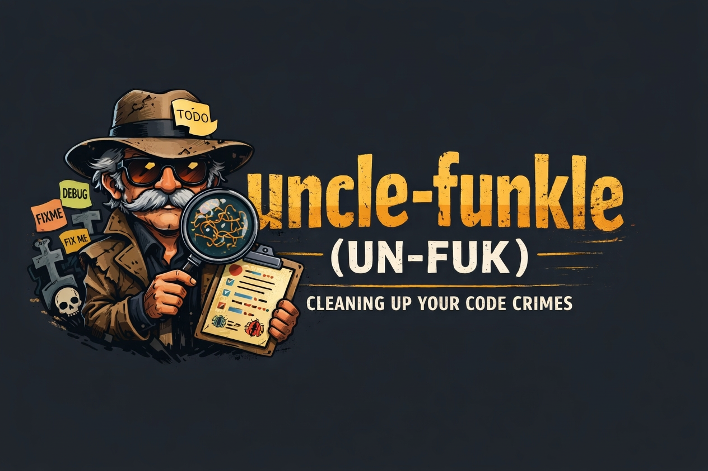

# Uncle Funkle (UNFUK for short)
[](https://github.com/blprnt-ai/uncle-funkle/actions/workflows/ci.yml)



`uncle-funkle` is a Rust library and CLI for scanning a codebase for maintainability problems, storing them as persistent issues, scoring the project, and generating a prioritized cleanup plan.

It focuses on practical heuristics like leftover TODOs, debug artifacts, oversized files, long functions, deep nesting, branch-heavy code, long lines, and duplicate blocks.

## Use

```sh
npm i -g @blprnt/unfuk
unfuk scan
```

```sh
npx @blprnt/unfuk scan
```

## Built For Agents


`uncle-funkle` is built to be useful in agent-driven workflows.

- the CLI gives an agent a simple way to scan a repo or inspect saved state
- the persisted state file lets an agent track issues across repeated runs
- stable issue IDs make it possible to resolve, defer, dismiss, or reopen work reliably
- the plan output gives an agent a ranked next task instead of a pile of noise
- JSON output makes it easy to plug into automated tooling and other systems

## What It Does

- scans source files across several common languages
- records findings as stable issues with lifecycle state
- persists project state to disk
- recomputes quality scores after each scan or review import
- generates a ranked plan for cleanup work
- supports subjective assessment imports alongside mechanical findings

## How It Works

The library follows a simple loop:

1. scan the project
2. merge findings into persisted state
3. recompute scores and stats
4. build a prioritized cleanup plan
5. save the updated state

State is stored under `.uncle_funkle/state.json` by default.

## Current Shape

This repo is both a library crate and a small CLI application.

The public surface is built around:

- creating an engine with config
- loading and saving state
- scanning a project
- merging scan output
- importing subjective assessments
- generating the next cleanup plan item
- resolving, deferring, dismissing, or reopening issues

The CLI supports a small workflow surface:

- `scan [path]` — scans a target directory, updates persisted state, and prints a summary plus the current next item
- `status [path] [issue_id]` — loads persisted state and prints the current next item, or the requested issue when an ID is provided
- `list [path] [--all]` — lists open issues by default or every issue with `--all`
- `next [path]` — resolves the current next issue and returns the new next item
- `resolve <issue_id> [path]`
- `defer <issue_id> [path]`
- `dismiss <issue_id> [path]`
- `reopen <issue_id> [path]`

## Usage

Run without installing:

- `npx @blprnt/unfuk scan`

Supported npm-distributed prebuilt targets: darwin-arm64, linux-x64, and win32-x64.

Or download a prebuilt binary from the GitHub Releases page.

If you prefer building locally:

- `cargo build --release`

Run a scan:

- `unfuk scan`
- `unfuk scan path/to/project`
- `npx @blprnt/unfuk scan`

Show saved status without rescanning:

- `unfuk status`
- `unfuk status path/to/project`
- `unfuk status path/to/project issue_123`

List issues:

- `unfuk list`
- `unfuk list path/to/project --all`

Advance or update issue state:

- `unfuk next`
- `unfuk resolve issue_123`
- `unfuk defer issue_123 path/to/project`
- `unfuk dismiss issue_123`
- `unfuk reopen issue_123`

Each scan updates `.uncle_funkle/state.json` in the target project.

## Defaults

By default the scanner:

- includes common source file extensions like Rust, Python, JavaScript, TypeScript, Go, C#, Dart, Java, Kotlin, C, C++, Ruby, and Swift
- skips generated or irrelevant directories like `.git`, `target`, `node_modules`, `build`, `dist`, `coverage`, virtualenvs, vendors, and its own state directory
- skips oversized or binary files

Default thresholds include:

- long line: 120 characters
- large file: 400 lines
- long function: 80 lines
- deep nesting: 4 levels
- branch density: 10 branch points
- duplicate block window: 6 lines

## Scores

The library maintains four scores:

- `objective` — based on active mechanical findings
- `strict` — harsher score with extra penalty for severe and reopened issues
- `overall` — blends objective and subjective review when available
- `verified` — the stricter final view when subjective review exists

## Status

What it is:

- a compact library for heuristic code quality triage
- persistent issue tracking across scans
- a scoring and cleanup-planning engine

What it is not:

- not an AST-heavy static analyzer
- not an auto-fixer
- not a security scanner

## License

MIT